# 📊 Database Diagram - Hệ Thống Tìm Kiếm Việc Làm & Đăng Tuyển Nhân Sự (Tinh Gọn)

> **Đề tài:** Hệ thống tìm kiếm việc làm và đăng tuyển nhân sự cho nhà tuyển dụng
> **Ngày cập nhật:** 15/06/2026
> **Phiên bản:** 2.0 (Simplified)
> **Quy mô:** Tinh gọn — Tập trung hoàn toàn vào lõi Đăng tuyển dụng & Tìm kiếm việc làm

---

## 📋 Mục Lục

1. [Tổng quan hệ thống tinh gọn](#tổng-quan-hệ-thống-tinh-gọn)
2. [Sơ đồ ER Diagram](#sơ-đồ-er-diagram)
3. [Mô tả chi tiết các bảng](#mô-tả-chi-tiết-các-bảng)

---

## Tổng Quan Hệ Thống Tinh Gọn

Hệ thống được thiết kế với **14 bảng**, bao gồm bảng danh mục kỹ năng dùng chung và bảng trung gian quản lý kỹ năng cho tin tuyển dụng.

| Bảng | Vai trò trong hệ thống |
| :--- | :--- |
| **`users`** | Lưu trữ thông tin tài khoản chung (Ứng viên, NTD, Admin). Nhà tuyển dụng (Employer) liên kết với công ty qua cột `company_id`. |
| **`companies`** | Lưu trữ thông tin chi tiết về công ty, doanh nghiệp đăng ký hoạt động. |
| **`candidate_profiles`** | Hồ sơ cá nhân của ứng viên (role=candidate), liên kết với kinh nghiệm, học vấn, kỹ năng và CVs. |
| **`candidate_experiences`** | Lưu các mốc kinh nghiệm làm việc chi tiết của ứng viên. |
| **`candidate_educations`** | Lưu lịch sử học tập, đào tạo tại trường học, trung tâm của ứng viên. |
| **`skills`** | Danh mục kỹ năng hệ thống dùng chung (React, NodeJS, Figma...). |
| **`candidate_skills`** | Lưu danh sách kỹ năng chuyên môn của ứng viên (liên kết với bảng `skills`). |
| **`candidate_cvs`** | Lưu danh sách các file CV tải lên của ứng viên. |
| **`jobs`** | Tin tuyển dụng của doanh nghiệp, có quản lý thời gian đăng tuyển, liên kết với kỹ năng qua bảng `job_skills`. |
| **`job_skills`** | Bảng trung gian liên kết các kỹ năng yêu cầu của tin tuyển dụng (`jobs`) với danh mục (`skills`). |
| **`applications`** | Lưu đơn ứng tuyển của ứng viên kèm bản chụp CV (CV snapshot) tại thời điểm ứng tuyển. |
| **`saved_jobs`** | Lưu trữ danh sách tin tuyển dụng yêu thích của ứng viên. |
| **`notifications`** | Thông báo hệ thống cho người dùng (ứng tuyển thành công, tin mới, v.v.). |
| **`user_tokens`** | Quản lý phiên làm việc, hỗ trợ đăng nhập đa thiết bị (JWT Refresh Tokens). |

---

## Sơ Đồ ER Diagram

```mermaid
erDiagram
    %% ============================================
    %% QUẢN LÝ CÔNG TY
    %% ============================================
    companies {
        int id PK "ID công ty"
        varchar name "Tên công ty"
        varchar logo "Logo công ty"
        varchar website "Website công ty"
        varchar address "Địa chỉ công ty"
        text description "Giới thiệu công ty"
        varchar size "Quy mô công ty"
        timestamp created_at "Ngày tạo"
        timestamp updated_at "Ngày cập nhật"
    }

    %% ============================================
    %% QUẢN LÝ NGƯỜI DÙNG
    %% ============================================
    users {
        int id PK "ID người dùng"
        varchar email UK "Email đăng nhập"
        varchar password_hash "Mật khẩu mã hóa"
        varchar full_name "Họ và tên"
        varchar phone "Số điện thoại"
        varchar avatar_url "Ảnh đại diện"
        enum role "candidate | employer | admin"
        enum status "active | inactive | banned"
        boolean email_verified "Xác thực email"
        timestamp last_login_at "Đăng nhập gần nhất"
        int company_id FK "ID công ty liên kết"
        timestamp created_at "Ngày tạo"
        timestamp updated_at "Ngày cập nhật"
    }

    %% ============================================
    %% HỒ SƠ ỨNG VIÊN
    %% ============================================
    candidate_profiles {
        int id PK "ID hồ sơ"
        int user_id FK "ID người dùng (1-1)"
        varchar title "Vị trí mong muốn"
        text summary "Giới thiệu bản thân"
        date date_of_birth "Ngày sinh"
        varchar gender "Giới tính"
        varchar address "Địa chỉ chi tiết"
        varchar province "Tỉnh/Thành phố"
        varchar experience_level "Cấp bậc kinh nghiệm"
        decimal expected_salary_min "Lương tối thiểu"
        decimal expected_salary_max "Lương tối đa"
        boolean is_open_to_work "Sẵn sàng nhận việc"
        
        timestamp created_at "Ngày tạo"
        timestamp updated_at "Ngày cập nhật"
    }

    %% ============================================
    %% KINH NGHIỆM, HỌC VẤN, KỸ NĂNG & CVS CỦA ỨNG VIÊN
    %% ============================================
    candidate_experiences {
        int id PK "ID kinh nghiệm"
        int profile_id FK "ID hồ sơ ứng viên"
        varchar company_name "Tên công ty"
        varchar position "Vị trí làm việc"
        date start_date "Ngày bắt đầu"
        date end_date "Ngày kết thúc"
        text description "Mô tả công việc"
        timestamp created_at "Ngày tạo"
        timestamp updated_at "Ngày cập nhật"
    }

    candidate_educations {
        int id PK "ID học vấn"
        int profile_id FK "ID hồ sơ ứng viên"
        varchar school_name "Tên trường học"
        varchar major "Chuyên ngành"
        varchar degree "Bằng cấp"
        date start_date "Ngày bắt đầu"
        date end_date "Ngày kết thúc"
        text description "Mô tả khóa học"
        timestamp created_at "Ngày tạo"
        timestamp updated_at "Ngày cập nhật"
    }

    skills {
        int id PK "ID kỹ năng"
        varchar name UK "Tên kỹ năng"
        timestamp created_at "Ngày tạo"
        timestamp updated_at "Ngày cập nhật"
    }

    candidate_skills {
        int id PK "ID kỹ năng ứng viên"
        int profile_id FK "ID hồ sơ ứng viên"
        int skill_id FK "ID kỹ năng"
        timestamp created_at "Ngày tạo"
        timestamp updated_at "Ngày cập nhật"
    }

    candidate_cvs {
        int id PK "ID CV"
        int profile_id FK "ID hồ sơ ứng viên"
        varchar cv_url "Đường dẫn file CV"
        text description "Mô tả/Ghi chú bản CV"
        timestamp created_at "Ngày tạo"
        timestamp updated_at "Ngày cập nhật"
    }

    %% ============================================
    %% TIN TUYỂN DỤNG (TINH GỌN)
    %% ============================================
    jobs {
        int id PK "ID tin"
        int employer_id FK "ID nhà tuyển dụng (users)"
        int company_id FK "ID công ty (companies)"
        varchar title "Tiêu đề"
        varchar slug UK "Slug URL"
        text description "Mô tả công việc"
        text requirements "Yêu cầu ứng viên"
        text benefits "Quyền lợi"
        varchar industry "Ngành nghề"
        enum job_type "Loại hình công việc (Toàn thời gian | Bán thời gian | Làm từ xa | Freelance | Thực tập)"
        varchar experience_level "Yêu cầu kinh nghiệm"
        int quantity "Số lượng tuyển"
        decimal salary_min "Lương tối thiểu"
        decimal salary_max "Lương tối đa"
        boolean is_salary_negotiable "Lương thỏa thuận"
        varchar work_address "Địa chỉ làm việc"
        varchar province "Tỉnh/Thành phố làm việc"
        
        enum status "draft | active | paused | closed"
        boolean is_featured "Tin nổi bật"
        boolean is_urgent "Tuyển gấp"
        int view_count "Lượt xem"
        int application_count "Số đơn ứng tuyển"
        
        %% Thời gian đăng tuyển
        timestamp posting_start_at "Bắt đầu đăng tuyển"
        timestamp posting_end_at "Kết thúc đăng tuyển"
        date deadline "Hạn nộp"
        timestamp published_at "Ngày đăng tin"
        
        timestamp created_at "Ngày tạo"
        timestamp updated_at "Ngày cập nhật"
    }

    job_skills {
        int id PK "ID kỹ năng tin tuyển dụng"
        int job_id FK "ID tin tuyển dụng"
        int skill_id FK "ID kỹ năng"
        timestamp created_at "Ngày tạo"
        timestamp updated_at "Ngày cập nhật"
    }

    %% ============================================
    %% ỨNG TUYỂN
    %% ============================================
    applications {
        int id PK "ID đơn ứng tuyển"
        int job_id FK "ID tin tuyển dụng"
        int profile_id FK "ID hồ sơ ứng viên (candidate_profiles)"
        text cover_letter "Thư giới thiệu"
        
        int candidate_cv_id FK "ID file CV ứng viên (candidate_cvs)"
        
        enum status "submitted | reviewing | shortlisted | hired | rejected"
        text employer_note "Ghi chú của NTD"
        timestamp submitted_at "Ngày nộp"
        timestamp reviewed_at "Ngày xem xét"
        timestamp created_at "Ngày tạo"
        timestamp updated_at "Ngày cập nhật"
    }

    %% ============================================
    %% LƯU TIN & THÔNG BÁO & PHIÊN ĐĂNG NHẬP
    %% ============================================
    saved_jobs {
        int id PK "ID"
        int user_id FK "ID ứng viên (users)"
        int job_id FK "ID tin tuyển dụng"
        timestamp created_at "Ngày lưu"
    }

    notifications {
        int id PK "ID"
        int user_id FK "ID người nhận (users)"
        enum type "application | job_match | system"
        varchar title "Tiêu đề"
        text content "Nội dung"
        varchar action_url "Link khi click"
        boolean is_read "Đã đọc"
        timestamp read_at "Thời gian đọc"
        timestamp created_at "Ngày tạo"
    }

    user_tokens {
        int id PK "ID"
        int user_id FK "ID người dùng (users)"
        varchar refresh_token "Mã Refresh Token"
        varchar device_id "Mã thiết bị"
        timestamp expires_at "Hạn sử dụng"
    }

    %% ============================================
    %% QUAN HỆ GIỮA CÁC BẢNG
    %% ============================================
    companies ||--o{ users : "có các nhân sự tuyển dụng"
    companies ||--o{ jobs : "có các tin tuyển dụng"
    users ||--o| candidate_profiles : "1-1 hồ sơ"
    users ||--o{ jobs : "đăng tin tuyển dụng"
    users ||--o{ user_tokens : "có các phiên đăng nhập"
    users ||--o{ notifications : "nhận thông báo"
    
    candidate_profiles ||--o{ candidate_experiences : "có kinh nghiệm làm việc"
    candidate_profiles ||--o{ candidate_educations : "có học vấn/chứng chỉ"
    candidate_profiles ||--o{ candidate_skills : "có kỹ năng"
    skills ||--o{ candidate_skills : "thuộc danh mục"
    candidate_profiles ||--o{ candidate_cvs : "có danh sách CV"
    
    jobs ||--o{ applications : "nhận đơn ứng tuyển"
    candidate_profiles ||--o{ applications : "nộp đơn ứng tuyển"
    candidate_cvs ||--o{ applications : "được dùng ứng tuyển"
    
    users ||--o{ saved_jobs : "lưu tin"
    jobs ||--o{ saved_jobs : "được lưu bởi"

    jobs ||--o{ job_skills : "yêu cầu kỹ năng"
    skills ||--o{ job_skills : "thuộc danh mục"
```

---

## Mô Tả Chi Tiết Các Bảng

### 1. 👤 `users` — Người dùng
> Bảng trung tâm lưu trữ tất cả tài khoản hệ thống. Nếu người dùng là **Nhà tuyển dụng (`employer`)**, họ sẽ liên kết với một doanh nghiệp trong bảng `companies` thông qua cột `company_id`.

| Trường | Kiểu | Mô tả |
| :--- | :--- | :--- |
| `id` | INT (PK) | ID tự tăng |
| `email` | VARCHAR (UK) | Email đăng nhập, duy nhất |
| `password_hash` | VARCHAR | Mật khẩu đã mã hóa (bcrypt) |
| `full_name` | VARCHAR | Họ và tên người dùng |
| `phone` | VARCHAR | Số điện thoại |
| `avatar_url` | VARCHAR | Ảnh đại diện |
| `role` | ENUM | Vai trò: `candidate`, `employer`, `admin` |
| `status` | ENUM | Trạng thái tài khoản: `active`, `inactive`, `banned` |
| `email_verified` | BOOLEAN | Trạng thái xác thực email |
| `last_login_at` | TIMESTAMP | Lần đăng nhập gần nhất |
| **`company_id`** | INT (FK) | Liên kết tới bảng `companies.id` (Chỉ dành cho Employer) |
| `created_at` | TIMESTAMP | Ngày tạo tài khoản |
| `updated_at` | TIMESTAMP | Ngày cập nhật |

---

### 2. 🏢 `companies` — Công ty / Doanh nghiệp
> Bảng lưu trữ thông tin của các doanh nghiệp, công ty đăng ký hoạt động tuyển dụng trên hệ thống.

| Trường | Kiểu | Mô tả |
| :--- | :--- | :--- |
| `id` | INT (PK) | ID tự tăng |
| `name` | VARCHAR | Tên công ty |
| `logo` | VARCHAR | URL logo công ty |
| `website` | VARCHAR | Website công ty |
| `address` | VARCHAR | Địa chỉ văn phòng công ty |
| `description` | TEXT | Giới thiệu chi tiết về công ty |
| `size` | VARCHAR | Quy mô công ty (Ví dụ: "10-50 nhân viên") |
| `created_at` | TIMESTAMP | Ngày tạo |
| `updated_at` | TIMESTAMP | Ngày cập nhật gần nhất |

---

### 3. 📝 `candidate_profiles` — Hồ sơ ứng viên
> Mỗi user có vai trò `candidate` sẽ sở hữu tối đa 1 bản ghi hồ sơ. Toàn bộ thông tin hồ sơ của ứng viên bao gồm thông tin cá nhân cơ bản và liên kết đến các bảng chi tiết về kinh nghiệm, học vấn, kỹ năng và danh sách CVs.

| Trường | Kiểu | Mô tả |
| :--- | :--- | :--- |
| `id` | INT (PK) | ID tự tăng |
| `user_id` | INT (FK) | Liên kết 1-1 đến bảng `users` |
| `title` | VARCHAR | Tiêu đề hồ sơ (Ví dụ: "Frontend Developer") |
| `summary` | TEXT | Giới thiệu bản thân |
| `date_of_birth` | DATE | Ngày sinh |
| `gender` | VARCHAR | Giới tính |
| `address` | VARCHAR | Địa chỉ liên lạc |
| `province` | VARCHAR | Tỉnh/Thành phố sinh sống |
| `experience_level` | VARCHAR | Cấp bậc kinh nghiệm (fresher, junior, middle...) |
| `expected_salary_min`| DECIMAL | Mức lương mong muốn tối thiểu (VND) |
| `expected_salary_max`| DECIMAL | Mức lương mong muốn tối đa (VND) |
| `is_open_to_work` | BOOLEAN | Trạng thái sẵn sàng nhận việc làm |
| `created_at` | TIMESTAMP | Ngày tạo hồ sơ |
| `updated_at` | TIMESTAMP | Ngày cập nhật |

---

### 3.1. 💼 `candidate_experiences` — Kinh nghiệm làm việc của ứng viên
> Lưu các mốc kinh nghiệm làm việc chi tiết của ứng viên.

| Trường | Kiểu | Mô tả |
| :--- | :--- | :--- |
| `id` | INT (PK) | ID tự tăng |
| **`profile_id`** | INT (FK) | Liên kết đến hồ sơ ứng viên `candidate_profiles.id` |
| `company_name` | VARCHAR | Tên công ty ứng viên từng làm việc |
| `position` | VARCHAR | Vị trí/Chức danh công việc đảm nhiệm |
| `start_date` | DATE | Ngày bắt đầu làm việc |
| `end_date` | DATE | Ngày kết thúc công việc (Nếu trống tức là đang làm việc tại đây) |
| `description` | TEXT | Mô tả chi tiết nhiệm vụ và thành tựu công việc |
| `created_at` | TIMESTAMP | Ngày tạo |
| `updated_at` | TIMESTAMP | Ngày cập nhật gần nhất |

---

### 3.2. 🎓 `candidate_educations` — Học vấn của ứng viên
> Lưu lịch sử học tập, đào tạo tại trường học, trung tâm của ứng viên.

| Trường | Kiểu | Mô tả |
| :--- | :--- | :--- |
| `id` | INT (PK) | ID tự tăng |
| **`profile_id`** | INT (FK) | Liên kết đến hồ sơ ứng viên `candidate_profiles.id` |
| `school_name` | VARCHAR | Tên trường đại học, trường nghề, trung tâm đào tạo |
| `major` | VARCHAR | Chuyên ngành học tập |
| `degree` | VARCHAR | Bằng cấp/Chứng chỉ đào tạo |
| `start_date` | DATE | Ngày bắt đầu học |
| `end_date` | DATE | Ngày tốt nghiệp/kết thúc khóa học |
| `description` | TEXT | Mô tả quá trình học tập hoặc các thành tích |
| `created_at` | TIMESTAMP | Ngày tạo |
| `updated_at` | TIMESTAMP | Ngày cập nhật gần nhất |

---

### 3.3. 🗂️ `skills` — Danh mục kỹ năng hệ thống
> Danh mục các kỹ năng công nghệ và chuyên môn dùng chung trên toàn hệ thống (React, NodeJS, Figma...).

| Trường | Kiểu | Mô tả |
| :--- | :--- | :--- |
| `id` | INT (PK) | ID tự tăng |
| `name` | VARCHAR (UK) | Tên kỹ năng chuyên môn, duy nhất |
| `created_at` | TIMESTAMP | Ngày tạo |
| `updated_at` | TIMESTAMP | Ngày cập nhật gần nhất |

---

### 3.4. 🛠️ `candidate_skills` — Kỹ năng của ứng viên
> Liên kết hồ sơ ứng viên với các kỹ năng từ danh mục hệ thống.

| Trường | Kiểu | Mô tả |
| :--- | :--- | :--- |
| `id` | INT (PK) | ID tự tăng |
| **`profile_id`** | INT (FK) | Liên kết đến hồ sơ ứng viên `candidate_profiles.id` (CASCADE) |
| **`skill_id`** | INT (FK) | Liên kết đến danh mục kỹ năng `skills.id` (CASCADE) |
| `created_at` | TIMESTAMP | Ngày tạo |
| `updated_at` | TIMESTAMP | Ngày cập nhật gần nhất |

---

### 3.5. 📄 `candidate_cvs` — Danh sách CV của ứng viên
> Lưu trữ danh sách các file CV đã tải lên của ứng viên.

| Trường | Kiểu | Mô tả |
| :--- | :--- | :--- |
| `id` | INT (PK) | ID tự tăng |
| **`profile_id`** | INT (FK) | Liên kết đến hồ sơ ứng viên `candidate_profiles.id` |
| `cv_url` | VARCHAR | Đường dẫn file CV trên hệ thống lưu trữ |
| `description` | TEXT | Ghi chú/Mô tả về bản CV (Ví dụ: "CV Node.js", "CV Tiếng Anh") |
| `created_at` | TIMESTAMP | Ngày tạo |
| `updated_at` | TIMESTAMP | Ngày cập nhật gần nhất |

---

### 4. 💼 `jobs` — Tin tuyển dụng
> Tin tuyển dụng do Employer đăng tuyển đại diện cho một Company. Ngành nghề và khu vực tỉnh thành được lưu trực tiếp dưới dạng chuỗi giúp lọc và hiển thị nhanh chóng. Kỹ năng yêu cầu được quản lý thông qua bảng liên kết `job_skills`.

| Trường | Kiểu | Mô tả |
| :--- | :--- | :--- |
| `id` | INT (PK) | ID tự tăng |
| `employer_id` | INT (FK) | ID của Nhà tuyển dụng tạo tin (Liên kết `users.id`) |
| **`company_id`** | INT (FK) | ID của công ty tuyển dụng (Liên kết `companies.id`) |
| `title` | VARCHAR | Tiêu đề công việc |
| `slug` | VARCHAR (UK) | Slug phục vụ đường dẫn URL thân thiện |
| `description` | TEXT | Mô tả chi tiết công việc |
| `requirements` | TEXT | Các yêu cầu đối với ứng viên |
| `benefits` | TEXT | Quyền lợi ứng viên nhận được |
| `industry` | VARCHAR | Lĩnh vực/Ngành nghề hoạt động của công việc |
| `job_type` | ENUM | Loại hình công việc ("Toàn thời gian", "Bán thời gian", "Làm từ xa", "Freelance", "Thực tập") |
| `experience_level` | VARCHAR | Yêu cầu kinh nghiệm đối với vị trí tuyển |
| `quantity` | INT | Số lượng cần tuyển |
| `salary_min` | DECIMAL | Mức lương tối thiểu (VND) |
| `salary_max` | DECIMAL | Lương tối đa (VND) |
| `is_salary_negotiable`| BOOLEAN | Lương thỏa thuận/Thương lượng |
| `work_address` | VARCHAR | Địa chỉ làm việc chi tiết |
| `province` | VARCHAR | Tỉnh/Thành phố làm việc |
| **`skills`** | TEXT[] | Mảng các kỹ năng công việc yêu cầu (Ví dụ: `['NestJS', 'PostgreSQL']`) |
| `status` | ENUM | Trạng thái tin: `draft`, `active`, `paused`, `closed` |
| `is_featured` | BOOLEAN | Tin tuyển dụng nổi bật |
| `is_urgent` | BOOLEAN | Tin tuyển dụng gấp |
| `view_count` | INT | Lượt xem tin tuyển dụng |
| `application_count` | INT | Số lượng hồ sơ đã nộp ứng tuyển |
| **`posting_start_at`**| TIMESTAMP | Thời gian bắt đầu hiển thị đăng tuyển |
| **`posting_end_at`** | TIMESTAMP | Thời gian kết thúc hiển thị tuyển dụng |
| `deadline` | DATE | Hạn cuối nộp hồ sơ ứng tuyển của ứng viên |
| `published_at` | TIMESTAMP | Thời gian công bố tin thực tế |
| `created_at` | TIMESTAMP | Ngày tạo tin |
| `updated_at` | TIMESTAMP | Ngày cập nhật |

---

### 5. 📨 `applications` — Đơn ứng tuyển
> Lưu trữ thông tin ứng tuyển của ứng viên vào tin tuyển dụng, liên kết trực tiếp với tệp CV của ứng viên tại thời điểm nộp đơn.

| Trường | Kiểu | Mô tả |
| :--- | :--- | :--- |
| `id` | INT (PK) | ID tự tăng |
| `job_id` | INT (FK) | Tin tuyển dụng ứng tuyển (Liên kết `jobs.id`) |
| `profile_id` | INT (FK) | Hồ sơ ứng viên nộp đơn (Liên kết `candidate_profiles.id`) |
| `cover_letter` | TEXT | Thư giới thiệu của ứng viên |
| **`candidate_cv_id`**| INT (FK) | Liên kết đến CV của ứng viên được nộp kèm (Liên kết `candidate_cvs.id`) |
| `status` | ENUM | Trạng thái đơn: `submitted`, `reviewing`, `shortlisted`, `hired`, `rejected` |
| `employer_note` | TEXT | Ghi chú nội bộ của nhà tuyển dụng |
| `submitted_at` | TIMESTAMP | Ngày giờ nộp đơn |
| `reviewed_at` | TIMESTAMP | Ngày giờ xem xét đơn |
| `created_at` | TIMESTAMP | Ngày tạo |
| `updated_at` | TIMESTAMP | Ngày cập nhật |

---

### 6. 🔖 `saved_jobs` — Việc làm đã lưu
> Lưu danh sách việc làm ưa thích của ứng viên.

| Trường | Kiểu | Mô tả |
| :--- | :--- | :--- |
| `id` | INT (PK) | ID tự tăng |
| `user_id` | INT (FK) | Người lưu tin (Liên kết `users.id`) |
| `job_id` | INT (FK) | Tin tuyển dụng được lưu (Liên kết `jobs.id`) |
| `created_at` | TIMESTAMP | Thời điểm lưu tin |

---

### 7. 🔔 `notifications` — Thông báo
> Thông báo hệ thống cho người dùng khi có sự kiện mới (trạng thái ứng tuyển thay đổi, việc làm gợi ý).

| Trường | Kiểu | Mô tả |
| :--- | :--- | :--- |
| `id` | INT (PK) | ID tự tăng |
| `user_id` | INT (FK) | Người nhận thông báo (Liên kết `users.id`) |
| `type` | ENUM | Phân loại: `application`, `job_match`, `system` |
| `title` | VARCHAR | Tiêu đề thông báo |
| `content` | TEXT | Nội dung chi tiết |
| `action_url` | VARCHAR | Link điều hướng hành động khi click |
| `is_read` | BOOLEAN | Trạng thái đã đọc |
| `read_at` | TIMESTAMP | Thời gian đọc thông báo |
| `created_at` | TIMESTAMP | Thời gian tạo thông báo |

---

### 8. 🔑 `user_tokens` — Phiên đăng nhập
> Quản lý JWT Refresh Tokens cho phép đăng nhập đa thiết bị và hỗ trợ thu hồi token từ xa.

| Trường | Kiểu | Mô tả |
| :--- | :--- | :--- |
| `id` | INT (PK) | ID tự tăng |
| `user_id` | INT (FK) | Tài khoản liên kết (Liên kết `users.id`) |
| `refresh_token` | VARCHAR | Chuỗi Refresh Token |
| `device_id` | VARCHAR | Mã nhận diện thiết bị đăng nhập |
| `expires_at` | TIMESTAMP | Thời gian hết hạn |

---

## 🔐 Các Ràng Buộc Cơ Bản
- **Khóa ngoại tự động xóa (CASCADE):** Các bản ghi ở bảng con (`candidate_profiles`, `candidate_experiences`, `candidate_educations`, `candidate_skills`, `candidate_cvs`, `jobs`, `job_skills`, `applications`, `saved_jobs`, `notifications`, `user_tokens`) sẽ tự động được xóa sạch khi các bản ghi chính tương ứng bị xóa. Ví dụ, khi xóa hồ sơ ứng viên (`candidate_profiles.id`) hoặc tin tuyển dụng (`jobs.id`), các liên kết trong `candidate_skills` và `job_skills` sẽ bị xóa theo (CASCADE ON DELETE). Tương tự khi một kỹ năng trong danh mục `skills.id` bị xóa, các dòng tương ứng ở `candidate_skills` và `job_skills` cũng tự động bị xóa sạch.
- **Ràng buộc khi xóa Công ty (companies):** Khi xóa một công ty (`companies.id`), các tin tuyển dụng (`jobs`) liên quan sẽ tự động bị xóa (CASCADE). Trường liên kết công ty của các người dùng tuyển dụng (`users.company_id`) sẽ được gán giá trị `NULL` (SET NULL) để không làm mất tài khoản người dùng.
- **Unique key:** Email người dùng (`users.email`), link slug của tin tuyển dụng (`jobs.slug`), tên kỹ năng (`skills.name`) là bắt buộc duy nhất trên toàn bộ cơ sở dữ liệu. Đồng thời, các cặp `(profile_id, skill_id)` trong `candidate_skills` và `(job_id, skill_id)` trong `job_skills` là duy nhất để tránh gán trùng lặp kỹ năng.
- **Index:** Tăng hiệu năng tìm kiếm việc làm bằng cách đánh Index trên các trường lọc nhiều nhất: `jobs.province`, `jobs.industry`, `jobs.status`, `jobs.deadline`, `jobs.posting_start_at`, `jobs.posting_end_at`, `candidate_profiles.province`, `users.company_id`, `jobs.company_id`, `candidate_experiences.profile_id`, `candidate_educations.profile_id`, `candidate_skills.profile_id`, `candidate_skills.skill_id`, `candidate_cvs.profile_id`, `job_skills.job_id`, `job_skills.skill_id`, `skills.name`.
