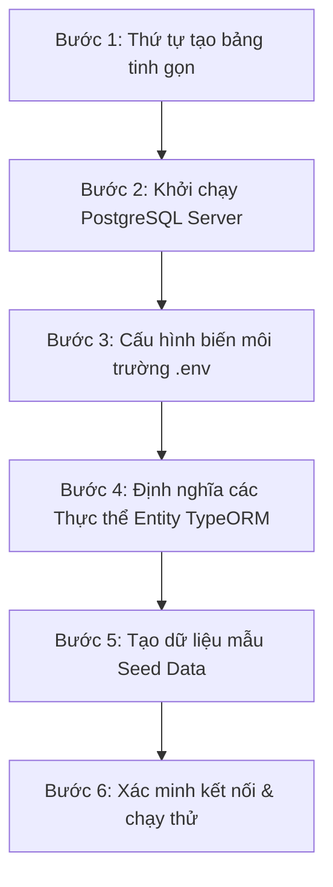
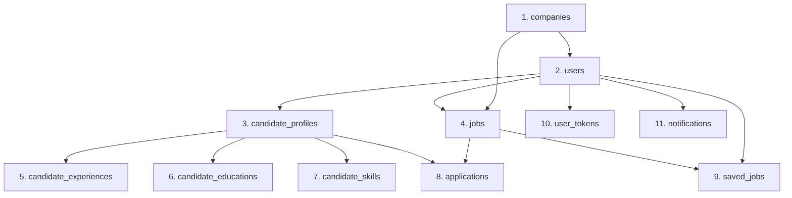

# 🚀 Quy Trình Từng Bước Xây Dựng Database PostgreSQL (TypeORM - Tinh Gọn)

Tài liệu này hướng dẫn chi tiết các bước để thiết lập và khởi tạo toàn bộ cơ sở dữ liệu dựa trên sơ đồ thiết kế tinh gọn [diagram.md](file:///d:/WCAG22/job-matching-wcag22/docs/database/diagram.md) và schema [database.dbml](file:///d:/WCAG22/job-matching-wcag22/docs/database/database.dbml) phiên bản 2.0.

---

## 📋 Tóm Tắt Quy Trình


---

## 🛠️ Chi Tiết Từng Bước Thực Hiện

### Bước 1: Thứ Tự Tạo Bảng (Table Creation Order)

Sau khi tách bảng Công ty và các bảng chi tiết hồ sơ ứng viên, hệ thống sẽ gồm **11 bảng**. Các mối quan hệ khóa ngoại (Foreign Key) được tổ chức theo thứ tự tạo bảng chính xác như sau để tránh lỗi khóa ngoại:

#### 📊 Sơ đồ thứ tự tạo bảng tinh gọn:


#### 📝 Thứ tự thực thi mã SQL / Migrations cụ thể:

| Thứ tự | Tên bảng | Lý do / Bảng cha cần tạo trước |
| :--- | :--- | :--- |
| **1** | `companies` | Độc lập (Không có khóa ngoại). Lưu thông tin công ty/doanh nghiệp. |
| **2** | `users` | Phụ thuộc vào: `companies` (company_id). Chứa thông tin tài khoản chung. |
| **3** | `candidate_profiles` | Phụ thuộc vào: `users` (user_id). Chứa thông tin hồ sơ ứng viên chính. |
| **4** | `jobs` | Phụ thuộc vào: `users` (employer_id) và `companies` (company_id). Chứa thông tin tuyển dụng. |
| **5** | `candidate_experiences` | Phụ thuộc vào: `candidate_profiles` (profile_id). Chi tiết kinh nghiệm làm việc. |
| **6** | `candidate_educations` | Phụ thuộc vào: `candidate_profiles` (profile_id). Chi tiết học vấn ứng viên. |
| **7** | `candidate_skills` | Phụ thuộc vào: `candidate_profiles` (profile_id). Chi tiết các kỹ năng chuyên môn. |
| **8** | `applications` | Phụ thuộc vào: `jobs` và `users` (candidate_id). Chứa thông tin ứng tuyển kèm bản chụp CV. |
| **9** | `saved_jobs` | Phụ thuộc vào: `users` và `jobs`. |
| **10** | `user_tokens` | Phụ thuộc vào: `users`. |
| **11** | `notifications` | Phụ thuộc vào: `users`. |

---

### Bước 2: Khởi Chạy PostgreSQL Server

Cách nhanh nhất để khởi chạy máy chủ PostgreSQL là sử dụng **Docker**:

1. Tạo file `docker-compose.yml` ở thư mục gốc dự án:
```yaml
version: '3.8'
services:
  postgres:
    image: postgres:15-alpine
    container_name: job_matching_postgres
    environment:
      POSTGRES_USER: postgres
      POSTGRES_PASSWORD: postgres
      POSTGRES_DB: job_matching_db
    ports:
      - "5432:5432"
    volumes:
      - postgres_data:/var/lib/postgresql/data

volumes:
  postgres_data:
```
2. Khởi chạy container:
```bash
docker-compose up -d
```

---

### Bước 3: Cấu Hình Biến Môi Trường `.env`

Đảm bảo file [`.env`](file:///d:/WCAG22/job-matching-wcag22/apps/backend/.env) khớp với cấu hình kết nối DB:

```env
# Database Configuration (PostgreSQL)
DB_HOST=localhost
DB_PORT=5432
DB_USERNAME=postgres
DB_PASSWORD=postgres
DB_NAME=job_matching_db
```

---

### Bước 4: Định Nghĩa Các Thực Thể (Entities) Trong Code

Với cấu trúc tinh gọn mới, chúng ta sử dụng các cột kiểu mảng (`simple-array` hoặc `text[]`) và kiểu đối tượng (`jsonb`) của PostgreSQL trong TypeORM.

#### 1. Ví dụ thực thể `User` (Đăng nhập + Thông tin Công ty):
```typescript
import { Entity, Column, ManyToOne, JoinColumn } from 'typeorm';
import { EntityBase } from '../../../common/entity/base.entity';
import { Company } from '../../companies/entities/company.entity';

@Entity('users')
export class User extends EntityBase {
  @Column({ unique: true })
  email: string;

  @Column({ name: 'password_hash' })
  passwordHash: string;

  @Column({ name: 'full_name' })
  fullName: string;

  @Column({ nullable: true })
  phone: string;

  @Column({ name: 'avatar_url', nullable: true })
  avatarUrl: string;

  @Column({ type: 'varchar', default: 'candidate' })
  role: string; // candidate | employer | admin

  // --- LIÊN KẾT CÔNG TY (Chỉ dành cho Employer) ---
  @ManyToOne(() => Company, { onDelete: 'SET NULL', nullable: true })
  @JoinColumn({ name: 'company_id' })
  company: Company;
}
```

#### 1.5 Thực thể `Company` (Công ty / Doanh nghiệp):
```typescript
import { Entity, Column } from 'typeorm';
import { EntityBase } from '../../../common/entity/base.entity';

@Entity('companies')
export class Company extends EntityBase {
  @Column()
  name: string;

  @Column({ name: 'logo', nullable: true })
  logo: string;

  @Column({ name: 'website', nullable: true })
  website: string;

  @Column({ name: 'address', nullable: true })
  address: string;

  @Column({ name: 'description', type: 'text', nullable: true })
  description: string;

  @Column({ name: 'company_size', nullable: true })
  companySize: string;
}
```

#### 2. Ví dụ thực thể `CandidateProfile` (Liên kết với Kinh nghiệm, Học vấn, Kỹ năng):
```typescript
import { Entity, Column, OneToOne, JoinColumn, OneToMany } from 'typeorm';
import { EntityBase } from '../../../common/entity/base.entity';
import { User } from '../../users/entities/user.entity';
import { CandidateExperience } from './candidate-experience.entity';
import { CandidateEducation } from './candidate-education.entity';
import { CandidateSkill } from './candidate-skill.entity';

@Entity('candidate_profiles')
export class CandidateProfile extends EntityBase {
  @OneToOne(() => User, { onDelete: 'CASCADE' })
  @JoinColumn({ name: 'user_id' })
  user: User;

  @Column({ nullable: true })
  title: string; // VD: Frontend Developer

  @Column({ type: 'text', nullable: true })
  summary: string;

  @Column({ name: 'date_of_birth', type: 'date', nullable: true })
  dateOfBirth: Date;

  @Column({ nullable: true })
  gender: string;

  @Column({ nullable: true })
  address: string;

  @Column({ nullable: true })
  province: string; // Lưu chuỗi trực tiếp: "Hà Nội"

  @Column({ name: 'experience_level', nullable: true })
  experienceLevel: string;

  // --- CV CHÍNH ĐÍNH KÈM ---
  @Column({ name: 'cv_url', nullable: true })
  cvUrl: string;

  @Column({ name: 'cv_file_name', nullable: true })
  cvFileName: string;

  // --- QUAN HỆ 1-N VỚI KINH NGHIỆM, HỌC VẤN, KỸ NĂNG ---
  @OneToMany(() => CandidateExperience, (exp) => exp.profile)
  experiences: CandidateExperience[];

  @OneToMany(() => CandidateEducation, (edu) => edu.profile)
  educations: CandidateEducation[];

  @OneToMany(() => CandidateSkill, (skill) => skill.profile)
  skills: CandidateSkill[];
}
```

#### 2.1. Thực thể `CandidateExperience` (Kinh nghiệm làm việc):
```typescript
import { Entity, Column, ManyToOne, JoinColumn } from 'typeorm';
import { EntityBase } from '../../../common/entity/base.entity';
import { CandidateProfile } from './candidate-profile.entity';

@Entity('candidate_experiences')
export class CandidateExperience extends EntityBase {
  @ManyToOne(() => CandidateProfile, (profile) => profile.experiences, { onDelete: 'CASCADE' })
  @JoinColumn({ name: 'profile_id' })
  profile: CandidateProfile;

  @Column({ name: 'company_name' })
  companyName: string;

  @Column()
  position: string;

  @Column({ name: 'start_date', type: 'date' })
  startDate: Date;

  @Column({ name: 'end_date', type: 'date', nullable: true })
  endDate: Date;

  @Column({ type: 'text', nullable: true })
  description: string;
}
```

#### 2.2. Thực thể `CandidateEducation` (Học vấn / Chứng chỉ):
```typescript
import { Entity, Column, ManyToOne, JoinColumn } from 'typeorm';
import { EntityBase } from '../../../common/entity/base.entity';
import { CandidateProfile } from './candidate-profile.entity';

@Entity('candidate_educations')
export class CandidateEducation extends EntityBase {
  @ManyToOne(() => CandidateProfile, (profile) => profile.educations, { onDelete: 'CASCADE' })
  @JoinColumn({ name: 'profile_id' })
  profile: CandidateProfile;

  @Column({ name: 'school_name' })
  schoolName: string;

  @Column({ nullable: true })
  major: string;

  @Column({ nullable: true })
  degree: string;

  @Column({ name: 'start_date', type: 'date' })
  startDate: Date;

  @Column({ name: 'end_date', type: 'date', nullable: true })
  endDate: Date;

  @Column({ type: 'text', nullable: true })
  description: string;
}
```

#### 2.3. Thực thể `CandidateSkill` (Kỹ năng ứng viên):
```typescript
import { Entity, Column, ManyToOne, JoinColumn } from 'typeorm';
import { EntityBase } from '../../../common/entity/base.entity';
import { CandidateProfile } from './candidate-profile.entity';

@Entity('candidate_skills')
export class CandidateSkill extends EntityBase {
  @ManyToOne(() => CandidateProfile, (profile) => profile.skills, { onDelete: 'CASCADE' })
  @JoinColumn({ name: 'profile_id' })
  profile: CandidateProfile;

  @Column({ name: 'skill_name' })
  skillName: string;
}
```
```

#### 3. Ví dụ thực thể `Job` (Tin tuyển dụng tinh gọn):
```typescript
import { Entity, Column, ManyToOne, JoinColumn } from 'typeorm';
import { EntityBase } from '../../../common/entity/base.entity';
import { User } from '../../users/entities/user.entity';
import { Company } from '../../companies/entities/company.entity';

@Entity('jobs')
export class Job extends EntityBase {
  @ManyToOne(() => User, { onDelete: 'CASCADE' })
  @JoinColumn({ name: 'employer_id' })
  employer: User;

  @ManyToOne(() => Company, { onDelete: 'CASCADE' })
  @JoinColumn({ name: 'company_id' })
  company: Company;

  @Column({ length: 300 })
  title: string;

  @Column({ unique: true })
  slug: string;

  @Column({ type: 'text' })
  description: string;

  @Column({ type: 'text', nullable: true })
  requirements: string;

  @Column({ type: 'text', nullable: true })
  benefits: string;

  @Column({ nullable: true })
  industry: string; // Ngành nghề (chuỗi): "Công nghệ thông tin"

  @Column({ type: 'varchar' })
  jobType: string; // full_time | part_time...

  @Column({ name: 'experience_level', nullable: true })
  experienceLevel: string;

  @Column({ type: 'text', array: true, nullable: true })
  skills: string[]; // ['NestJS', 'PostgreSQL']

  @Column({ nullable: true })
  province: string; // Địa điểm làm việc (chuỗi): "TP. Hồ Chí Minh"

  // --- THỜI GIAN ĐĂNG TUYỂN ---
  @Column({ name: 'posting_start_at', type: 'timestamp', default: () => 'CURRENT_TIMESTAMP' })
  postingStartAt: Date;

  @Column({ name: 'posting_end_at', type: 'timestamp', nullable: true })
  postingEndAt: Date;

  @Column({ name: 'deadline', type: 'date', nullable: true })
  deadline: Date;

  @Column({ name: 'published_at', type: 'timestamp', nullable: true })
  publishedAt: Date;
}
```

---

### Bước 5: Khởi Tạo Dữ Liệu Ban Đầu (Seed Data)

Do các bảng danh mục như Tỉnh thành (`provinces`) hay Ngành nghề (`industries`) đã được thay thế bằng chuỗi, hệ thống **không cần** các bảng seed phức tạp này nữa. Bạn chỉ cần seed dữ liệu người dùng mẫu (Admin, Ứng viên mẫu, Nhà tuyển dụng mẫu) và một số Tin tuyển dụng mẫu để hệ thống bắt đầu chạy thử.

---

### Bước 6: Đánh Chỉ Mục (Index) Cho Hiệu Năng
Mặc dù tinh gọn bảng, bạn vẫn nên giữ các index quan trọng sau để đảm bảo tốc độ tìm kiếm tin tuyển dụng và truy vấn thông tin hồ sơ:
- **`idx_jobs_province_industry`**: Tạo index tổ hợp trên `(province, industry, status)` trong bảng `jobs` để tối ưu hóa bộ lọc tìm kiếm việc làm của ứng viên.
- **`idx_jobs_skills`**: Sử dụng GIN index trên cột `skills` (`TEXT[]`) để tìm kiếm tin theo kỹ năng cực nhanh:
  ```sql
  CREATE INDEX idx_jobs_skills ON jobs USING gin (skills);
  ```
- **`idx_jobs_posting_time`**: Đánh index trên `posting_start_at` và `posting_end_at` để truy vấn lọc tin tuyển dụng đang trong hạn đăng tuyển nhanh hơn.
- **`idx_users_company`** & **`idx_jobs_company`**: Đánh index trên các trường khóa ngoại liên kết tới công ty (`users.company_id` và `jobs.company_id`) nhằm tối ưu hóa hiệu năng JOIN dữ liệu.
- **`idx_candidate_experiences_profile`**, **`idx_candidate_educations_profile`** & **`idx_candidate_skills_profile`**: Đánh index trên cột `profile_id` ở các bảng kinh nghiệm, học vấn và kỹ năng để tăng tốc độ tải thông tin chi tiết của hồ sơ ứng viên.
