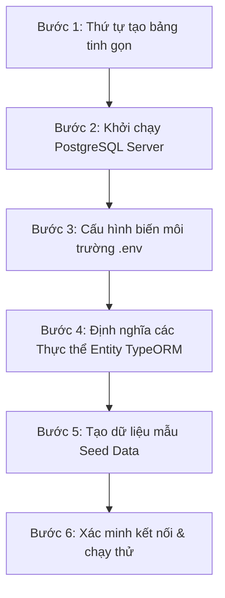
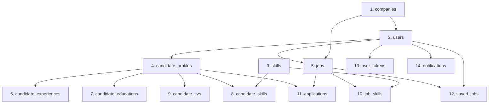

# 🚀 Quy Trình Từng Bước Xây Dựng Database PostgreSQL (TypeORM - Tinh Gọn)

Tài liệu này hướng dẫn chi tiết các bước để thiết lập và khởi tạo toàn bộ cơ sở dữ liệu dựa trên sơ đồ thiết kế tinh gọn [diagram.md](file:///d:/WCAG22/job-matching-wcag22/docs/database/diagram.md) và schema [database.dbml](file:///d:/WCAG22/job-matching-wcag22/docs/database/database.dbml) phiên bản 2.0.

---

## 📋 Tóm Tắt Quy Trình


---

## 🛠️ Chi Tiết Từng Bước Thực Hiện

### Bước 1: Thứ Tự Tạo Bảng (Table Creation Order)

Sau khi thêm bảng danh mục Kỹ năng và bảng trung gian liên kết kỹ năng, hệ thống sẽ gồm **14 bảng**. Các mối quan hệ khóa ngoại (Foreign Key) được tổ chức theo thứ tự tạo bảng chính xác như sau để tránh lỗi khóa ngoại:

#### 📊 Sơ đồ thứ tự tạo bảng tinh gọn:


#### 📝 Thứ tự thực thi mã SQL / Migrations cụ thể:

| Thứ tự | Tên bảng | Lý do / Bảng cha cần tạo trước |
| :--- | :--- | :--- |
| **1** | `companies` | Độc lập (Không có khóa ngoại). Lưu thông tin công ty/doanh nghiệp. |
| **2** | `users` | Phụ thuộc vào: `companies` (company_id). Chứa thông tin tài khoản chung. |
| **3** | `skills` | Độc lập (Không có khóa ngoại). Danh mục kỹ năng hệ thống dùng chung. |
| **4** | `candidate_profiles` | Phụ thuộc vào: `users` (user_id). Chứa thông tin hồ sơ ứng viên chính. |
| **5** | `jobs` | Phụ thuộc vào: `users` (employer_id) và `companies` (company_id). Chứa thông tin tuyển dụng. |
| **6** | `candidate_experiences` | Phụ thuộc vào: `candidate_profiles` (profile_id). Chi tiết kinh nghiệm làm việc. |
| **7** | `candidate_educations` | Phụ thuộc vào: `candidate_profiles` (profile_id). Chi tiết học vấn ứng viên. |
| **8** | `candidate_skills` | Phụ thuộc vào: `candidate_profiles` và `skills`. Chi tiết kỹ năng ứng viên. |
| **9** | `candidate_cvs` | Phụ thuộc vào: `candidate_profiles` (profile_id). Lưu danh sách các file CV của ứng viên. |
| **10** | `job_skills` | Phụ thuộc vào: `jobs` và `skills`. Bảng trung gian liên kết kỹ năng tin tuyển dụng. |
| **11** | `applications` | Phụ thuộc vào: `jobs` và `users` (candidate_id). Chứa thông tin ứng tuyển kèm bản chụp CV. |
| **12** | `saved_jobs` | Phụ thuộc vào: `users` và `jobs`. |
| **13** | `user_tokens` | Phụ thuộc vào: `users`. |
| **14** | `notifications` | Phụ thuộc vào: `users`. |

---

### Bước 2: Khởi Chạy PostgreSQL Server

Cách nhanh nhất để khởi chạy máy chủ PostgreSQL là sử dụng **Docker**:

1. Tạo file `docker-compose.yml` ở thư mục gốc dự án:
```yaml
version: '3.8'
services:
  postgres:
    image: postgres:15-alpine
    container_name: job_matching_postgres
    environment:
      POSTGRES_USER: postgres
      POSTGRES_PASSWORD: postgres
      POSTGRES_DB: job_matching_db
    ports:
      - "5432:5432"
    volumes:
      - postgres_data:/var/lib/postgresql/data

volumes:
  postgres_data:
```
2. Khởi chạy container:
```bash
docker-compose up -d
```

---

### Bước 3: Cấu Hình Biến Môi Trường `.env`

Đảm bảo file [`.env`](file:///d:/WCAG22/job-matching-wcag22/apps/backend/.env) khớp với cấu hình kết nối DB:

```env
# Database Configuration (PostgreSQL)
DB_HOST=localhost
DB_PORT=5432
DB_USERNAME=postgres
DB_PASSWORD=postgres
DB_NAME=job_matching_db
```

---

### Bước 4: Định Nghĩa Các Thực Thể (Entities) Trong Code

Với cấu trúc tinh gọn mới, chúng ta sử dụng các cột kiểu mảng (`simple-array` hoặc `text[]`) và kiểu đối tượng (`jsonb`) của PostgreSQL trong TypeORM.

#### 1. Ví dụ thực thể `User` (Đăng nhập + Thông tin Công ty):
```typescript
import { Entity, Column, ManyToOne, JoinColumn } from 'typeorm';
import { EntityBase } from '../../../common/entity/base.entity';
import { Company } from '../../companies/entities/company.entity';

@Entity('users')
export class User extends EntityBase {
  @Column({ unique: true })
  email: string;

  @Column({ name: 'password_hash' })
  passwordHash: string;

  @Column({ name: 'full_name' })
  fullName: string;

  @Column({ nullable: true })
  phone: string;

  @Column({ name: 'avatar_url', nullable: true })
  avatarUrl: string;

  @Column({ type: 'varchar', default: 'candidate' })
  role: string; // candidate | employer | admin

  // --- LIÊN KẾT CÔNG TY (Chỉ dành cho Employer) ---
  @ManyToOne(() => Company, { onDelete: 'SET NULL', nullable: true })
  @JoinColumn({ name: 'company_id' })
  company: Company;
}
```

#### 1.5 Thực thể `Company` (Công ty / Doanh nghiệp):
```typescript
import { Entity, Column } from 'typeorm';
import { EntityBase } from '../../../common/entity/base.entity';

@Entity('companies')
export class Company extends EntityBase {
  @Column()
  name: string;

  @Column({ name: 'logo', nullable: true })
  logo: string;

  @Column({ name: 'website', nullable: true })
  website: string;

  @Column({ name: 'address', nullable: true })
  address: string;

  @Column({ name: 'description', type: 'text', nullable: true })
  description: string;

  @Column({ name: 'company_size', nullable: true })
  companySize: string;
}
```

#### 2. Ví dụ thực thể `CandidateProfile` (Liên kết với Kinh nghiệm, Học vấn, Kỹ năng, CVs):
```typescript
import { Entity, Column, OneToOne, JoinColumn, OneToMany } from 'typeorm';
import { EntityBase } from '../../../common/entity/base.entity';
import { User } from '../../users/entities/user.entity';
import { CandidateExperience } from './candidate-experience.entity';
import { CandidateEducation } from './candidate-education.entity';
import { CandidateSkill } from './candidate-skill.entity';
import { CandidateCv } from './candidate-cv.entity';

@Entity('candidate_profiles')
export class CandidateProfile extends EntityBase {
  @OneToOne(() => User, { onDelete: 'CASCADE' })
  @JoinColumn({ name: 'user_id' })
  user: User;

  @Column({ nullable: true })
  title: string; // VD: Frontend Developer

  @Column({ type: 'text', nullable: true })
  summary: string;

  @Column({ name: 'date_of_birth', type: 'date', nullable: true })
  dateOfBirth: Date;

  @Column({ nullable: true })
  gender: string;

  @Column({ nullable: true })
  address: string;

  @Column({ nullable: true })
  province: string; // Lưu chuỗi trực tiếp: "Hà Nội"

  @Column({ name: 'experience_level', nullable: true })
  experienceLevel: string;

  // --- QUAN HỆ VỚI CV, KINH NGHIỆM, HỌC VẤN, KỸ NĂNG ---
  @OneToMany(() => CandidateCv, (cv) => cv.profile)
  cvs: CandidateCv[];

  @OneToMany(() => CandidateExperience, (exp) => exp.profile)
  experiences: CandidateExperience[];

  @OneToMany(() => CandidateEducation, (edu) => edu.profile)
  educations: CandidateEducation[];

  @OneToMany(() => CandidateSkill, (skill) => skill.profile)
  skills: CandidateSkill[];
}
```

#### 2.1. Thực thể `CandidateExperience` (Kinh nghiệm làm việc):
```typescript
import { Entity, Column, ManyToOne, JoinColumn } from 'typeorm';
import { EntityBase } from '../../../common/entity/base.entity';
import { CandidateProfile } from './candidate-profile.entity';

@Entity('candidate_experiences')
export class CandidateExperience extends EntityBase {
  @ManyToOne(() => CandidateProfile, (profile) => profile.experiences, { onDelete: 'CASCADE' })
  @JoinColumn({ name: 'profile_id' })
  profile: CandidateProfile;

  @Column({ name: 'company_name' })
  companyName: string;

  @Column()
  position: string;

  @Column({ name: 'start_date', type: 'date' })
  startDate: Date;

  @Column({ name: 'end_date', type: 'date', nullable: true })
  endDate: Date;

  @Column({ type: 'text', nullable: true })
  description: string;
}
```

#### 2.2. Thực thể `CandidateEducation` (Học vấn / Chứng chỉ):
```typescript
import { Entity, Column, ManyToOne, JoinColumn } from 'typeorm';
import { EntityBase } from '../../../common/entity/base.entity';
import { CandidateProfile } from './candidate-profile.entity';

@Entity('candidate_educations')
export class CandidateEducation extends EntityBase {
  @ManyToOne(() => CandidateProfile, (profile) => profile.educations, { onDelete: 'CASCADE' })
  @JoinColumn({ name: 'profile_id' })
  profile: CandidateProfile;

  @Column({ name: 'school_name' })
  schoolName: string;

  @Column({ nullable: true })
  major: string;

  @Column({ nullable: true })
  degree: string;

  @Column({ name: 'start_date', type: 'date' })
  startDate: Date;

  @Column({ name: 'end_date', type: 'date', nullable: true })
  endDate: Date;

  @Column({ type: 'text', nullable: true })
  description: string;
}
```

#### 2.3. Thực thể `Skill` (Danh mục kỹ năng hệ thống):
```typescript
import { Entity, Column, Unique } from 'typeorm';
import { EntityBase } from '../../../common/entity/base.entity';

@Entity('skills')
@Unique(['name'])
export class Skill extends EntityBase {
  @Column({ length: 100 })
  name: string;
}
```

#### 2.4. Thực thể `CandidateSkill` (Kỹ năng ứng viên):
```typescript
import { Entity, ManyToOne, JoinColumn, Unique } from 'typeorm';
import { EntityBase } from '../../../common/entity/base.entity';
import { CandidateProfile } from './candidate-profile.entity';
import { Skill } from '../../skills/entities/skill.entity';

@Entity('candidate_skills')
@Unique(['profile', 'skill'])
export class CandidateSkill extends EntityBase {
  @ManyToOne(() => CandidateProfile, (profile) => profile.skills, { onDelete: 'CASCADE' })
  @JoinColumn({ name: 'profile_id' })
  profile: CandidateProfile;

  @ManyToOne(() => Skill, { onDelete: 'CASCADE' })
  @JoinColumn({ name: 'skill_id' })
  skill: Skill;
}
```

#### 2.5. Thực thể `CandidateCv` (Danh sách CV của ứng viên):
```typescript
import { Entity, Column, ManyToOne, JoinColumn } from 'typeorm';
import { EntityBase } from '../../../common/entity/base.entity';
import { CandidateProfile } from './candidate-profile.entity';

@Entity('candidate_cvs')
export class CandidateCv extends EntityBase {
  @ManyToOne(() => CandidateProfile, (profile) => profile.cvs, { onDelete: 'CASCADE' })
  @JoinColumn({ name: 'profile_id' })
  profile: CandidateProfile;

  @Column({ name: 'cv_url', length: 500 })
  cvUrl: string;

  @Column({ type: 'text', nullable: true })
  description: string | null;

  @Column({ name: 'is_main', default: false })
  isMain: boolean;
}
```


#### 3. Ví dụ thực thể `Job` (Tin tuyển dụng tinh gọn):
```typescript
import { Entity, Column, ManyToOne, JoinColumn, OneToMany } from 'typeorm';
import { EntityBase } from '../../../common/entity/base.entity';
import { User } from '../../users/entities/user.entity';
import { Company } from '../../companies/entities/company.entity';
import { JobSkill } from './job-skill.entity';

export enum JobType {
  FULL_TIME = 'Toàn thời gian',
  PART_TIME = 'Bán thời gian',
  REMOTE = 'Làm từ xa',
  FREELANCE = 'Freelance',
  INTERNSHIP = 'Thực tập',
}

@Entity('jobs')
export class Job extends EntityBase {
  @ManyToOne(() => User, { onDelete: 'CASCADE' })
  @JoinColumn({ name: 'employer_id' })
  employer: User;

  @Column({ name: 'employer_id', type: 'integer' })
  employerId: number;

  @ManyToOne(() => Company, { onDelete: 'CASCADE' })
  @JoinColumn({ name: 'company_id' })
  company: Company;

  @Column({ name: 'company_id', type: 'integer' })
  companyId: number;

  @Column({ length: 300 })
  title: string;

  @Column({ unique: true })
  slug: string;

  @Column({ type: 'text' })
  description: string;

  @Column({ type: 'text', nullable: true })
  requirements?: string | null;

  @Column({ type: 'text', nullable: true })
  benefits?: string | null;

  @Column({ nullable: true })
  industry?: string | null; // Ngành nghề (chuỗi): "Công nghệ thông tin"

  @Column({
    name: 'job_type',
    type: 'enum',
    enum: JobType,
    default: JobType.FULL_TIME,
  })
  jobType: JobType;

  @Column({ name: 'experience_level', nullable: true })
  experienceLevel?: string | null;

  @Column({ type: 'integer', default: 1 })
  quantity: number;

  @Column({ name: 'salary_min', type: 'decimal', precision: 15, scale: 2, nullable: true })
  salaryMin?: number | null;

  @Column({ name: 'salary_max', type: 'decimal', precision: 15, scale: 2, nullable: true })
  salaryMax?: number | null;

  @Column({ name: 'is_salary_negotiable', type: 'boolean', default: false })
  isSalaryNegotiable: boolean;

  @Column({ name: 'work_address', type: 'varchar', length: 255, nullable: true })
  workAddress?: string | null;

  @Column({ nullable: true })
  province?: string | null; // Địa điểm làm việc (chuỗi): "TP. Hồ Chí Minh"

  @OneToMany(() => JobSkill, (jobSkill) => jobSkill.job)
  skills: JobSkill[];

  @Column({ type: 'varchar', default: 'draft' })
  status: string; // draft | active | paused | closed

  @Column({ name: 'is_featured', type: 'boolean', default: false })
  isFeatured: boolean;

  @Column({ name: 'is_urgent', type: 'boolean', default: false })
  isUrgent: boolean;

  @Column({ name: 'view_count', type: 'integer', default: 0 })
  viewCount: number;

  @Column({ name: 'application_count', type: 'integer', default: 0 })
  applicationCount: number;

  // --- THỜI GIAN ĐĂNG TUYỂN ---
  @Column({ name: 'posting_start_at', type: 'timestamp', default: () => 'CURRENT_TIMESTAMP' })
  postingStartAt: Date;

  @Column({ name: 'posting_end_at', type: 'timestamp', nullable: true })
  postingEndAt?: Date | null;

  @Column({ name: 'deadline', type: 'date', nullable: true })
  deadline?: Date | null;

  @Column({ name: 'published_at', type: 'timestamp', nullable: true })
  publishedAt?: Date | null;
}
```

#### 3.1. Thực thể `JobSkill` (Kỹ năng của tin tuyển dụng):
```typescript
import { Entity, ManyToOne, JoinColumn, Unique } from 'typeorm';
import { EntityBase } from '../../../common/entity/base.entity';
import { Job } from './job.entity';
import { Skill } from '../../skills/entities/skill.entity';

@Entity('job_skills')
@Unique(['job', 'skill'])
export class JobSkill extends EntityBase {
  @ManyToOne(() => Job, (job) => job.skills, { onDelete: 'CASCADE' })
  @JoinColumn({ name: 'job_id' })
  job: Job;

  @ManyToOne(() => Skill, { onDelete: 'CASCADE' })
  @JoinColumn({ name: 'skill_id' })
  skill: Skill;
}
```

---

### Bước 5: Khởi Tạo Dữ Liệu Ban Đầu (Seed Data)

Do các bảng danh mục như Tỉnh thành (`provinces`) hay Ngành nghề (`industries`) đã được thay thế bằng chuỗi, hệ thống **không cần** các bảng seed phức tạp này nữa. Bạn chỉ cần seed dữ liệu người dùng mẫu (Admin, Ứng viên mẫu, Nhà tuyển dụng mẫu), danh mục kỹ năng hệ thống (`skills`) như React, NodeJS, Java, Python..., và một số Tin tuyển dụng mẫu để hệ thống bắt đầu chạy thử.

---

### Bước 6: Đánh Chỉ Mục (Index) Cho Hiệu Năng
Mặc dù tinh gọn bảng, bạn vẫn nên giữ các index quan trọng sau để đảm bảo tốc độ tìm kiếm tin tuyển dụng và truy vấn thông tin hồ sơ:
- **`idx_jobs_province_industry`**: Tạo index tổ hợp trên `(province, industry, status)` trong bảng `jobs` để tối ưu hóa bộ lọc tìm kiếm việc làm của ứng viên.
- **`idx_job_skills_unique`**: Ràng buộc unique index tổ hợp trên `(job_id, skill_id)` của `job_skills`.
- **`idx_candidate_skills_unique`**: Ràng buộc unique index tổ hợp trên `(profile_id, skill_id)` của `candidate_skills`.
- **`idx_jobs_posting_time`**: Đánh index trên `posting_start_at` và `posting_end_at` để truy vấn lọc tin tuyển dụng đang trong hạn đăng tuyển nhanh hơn.
- **`idx_users_company`** & **`idx_jobs_company`**: Đánh index trên các trường khóa ngoại liên kết tới công ty (`users.company_id` và `jobs.company_id`) nhằm tối ưu hóa hiệu năng JOIN dữ liệu.
- **`idx_candidate_experiences_profile`**, **`idx_candidate_educations_profile`**, **`idx_candidate_skills_profile`**, **`idx_candidate_cvs_profile`**: Đánh index trên cột `profile_id` ở các bảng liên kết để tăng tốc độ tải thông tin chi tiết của hồ sơ ứng viên.
- **`idx_candidate_cvs_main`**: Tạo index tổ hợp `(profile_id, is_main)` trên bảng CVs nhằm tăng tốc tìm kiếm CV chính của ứng viên.

